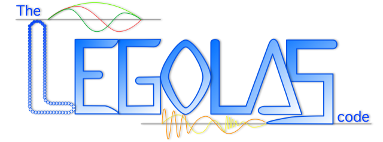

**L**arge **E**igensystem **G**enerator for **O**ne-dimensional p**LAS**mas

     

### Table of contents
1. [About](#about-legolas)
2. [Documentation](#documentation)
3. [Versions](#stable-and-develop-versions)
4. [Using Legolas](#using-legolas)

## About Legolas
The main goal of Legolas is to provide a new and modern user-friendly code while making use of the most recent developments in linear algebra and theoretical (linear) MHD, allowing for high resolution eigenspectrum studies with various physical effects included.

Legolas is being developed and maintained at the [Centre for mathematical Plasma-Astrophysics](https://wis.kuleuven.be/CmPA), KU Leuven, Belgium.

## Documentation
We have a dedicated website on [legolas.science](https://legolas.science) which contains a detailed guide on how to install, compile and use the code. There you can also find the source code documentation of both Legolas and the post-processing framework Pylbo, which is rendered straight from the `master` (or `develop`) branch and updated on every commit.

## Stable and develop versions
The `master` branch of this repository should contain the latest stable release of the code, the main website is built from this branch. If you would like to check out the latest development goodies instead you can take a look at the `develop` branch. As there may be some time between major releases it is possible that the development branch can be quite different from the stable branch. However, the development version has its own dedicated website at [dev.legolas.science](https://dev.legolas.science), for those who want to use the bleeding-edge version of the code.

Note that while everything on the `develop` branch _should_ be stable, it is possible that some features there are still under development and/or not yet entirely tested or documented.

## Using Legolas
:warning: **Please note**

Legolas has taken (and still takes up) a lot of effort and time to test, develop and maintain.
Since the code is relatively new we would like to know how it is used and provide guidance if possible.
To that end, we kindly ask that the _**the first published peer-reviewed paper from applying Legolas is done in co-authorship with at least one of the original authors**_. The BibTex citation to our ApJS method paper can be found [here](https://ui.adsabs.harvard.edu/abs/2020arXiv201014148C/exportcitation).
